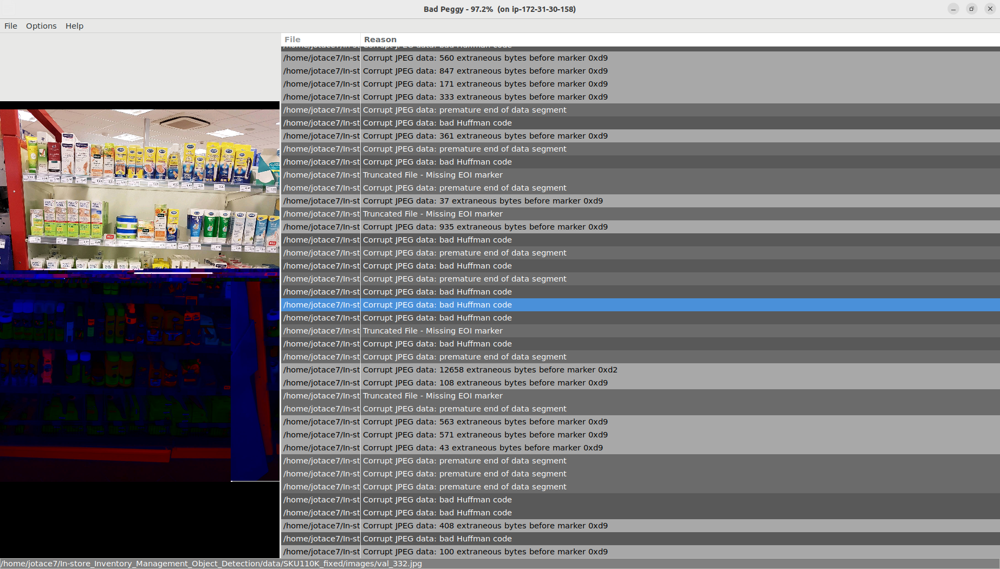

# In-Store Inventory Management Object Detection

## 1. Install

### Build docker image

You can use `Docker` to install all the needed packages and libraries easily. Two Dockerfiles are provided for both CPU and GPU support.

- **CPU:**

```bash
$ docker build -t ins_inv_mng_obj_detect_jc --build-arg USER_ID=$(id -u) --build-arg GROUP_ID=$(id -g) -f docker/Dockerfile .
```

- **GPU:**

```bash
$ docker build -t ins_inv_mng_obj_detect_gpu_jc --build-arg USER_ID=$(id -u) --build-arg GROUP_ID=$(id -g) -f docker/Dockerfile_gpu .
```

### Install BadPeggy

Bad Peggy scans JPEG and other image formats for damage and other blemishes and shows the results and images instantly. It allows you to find such broken files quickly, inspect and then either delete or move them to a different location.

It is implemented in Java 17 and SWT. Runs on Windows, MacOS and Linux.
Let's make sure we have the lates version of jre.  In case you have an older version installed we will need to upgrade it.

```bash
$ java --version
$ sudo apt-get purge openjdk-\*
$ sudo apt install libc6-i386 libc6-x32 libxi6 libxtst6 -y
$ wget https://download.oracle.com/java/19/archive/jdk-19.0.1_linux-x64_bin.deb
$ sudo apt install ./jdk-19.0.1_linux-x64_bin.deb 
export PATH=$PATH:/usr/lib/jvm/jdk-19/bin
```

Download BadPeggy, unzip and install it
```bash
$ wget https://github.com/coderslagoon/BadPeggy/releases/download/v2.4.0/badpeggy-2.4.0_linux.zip
$ unzip badpeggy-2.4.0_linux.zip
$ cd BadPeggy-2.4.0
$ ./install.sh
$ sudo apt install libcanberra-gtk-module libcanberra-gtk3-module
```

If you are running from a remote serber, add 
```
  ForwardX11 yes
  ForwardX11Trusted yes
```
to ssh configuration file

Now you can run BadPeggy
```bash
$ java -jar badpeggy.jar 
```

Open folde data/SKU-110k_fixed and run analisys, then export list to data/badpeggy_list.txt file




## 2. Download SKU110K Dataset

### Configure AWS CLI
```bash
$ aws configure
```

### Sync bucket

```bash
$ mkdir data
$ cd data
$ aws s3 sync s3://anyoneai-datasets/SKU-110K/SKU110K_fixed/ SKU-110K_fixed
```

## 3. Run Docker Container

- **CPU:**

```bash
$ docker run --rm --net host -it -v "$(pwd)":/home/app/src --workdir /home/app/src ins_inv_mng_obj_detect_jc bash
```

- **GPU:**

```bash
$ docker run --rm --net host --gpus all -it -v "$(pwd)":/home/app/src --workdir /home/app/src ins_inv_mng_obj_detect_gpu_jc bash
```